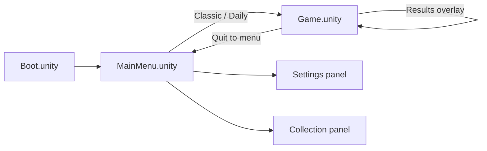
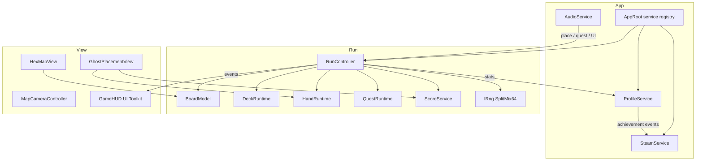
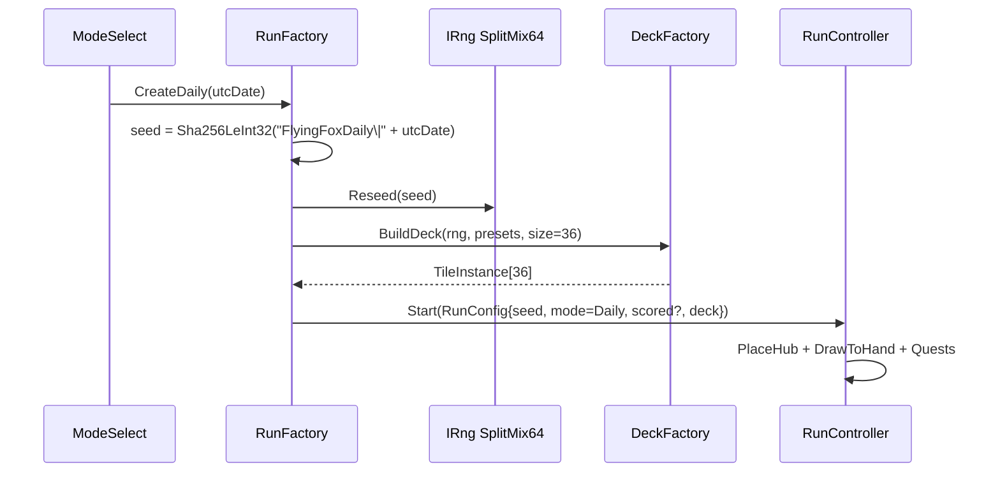
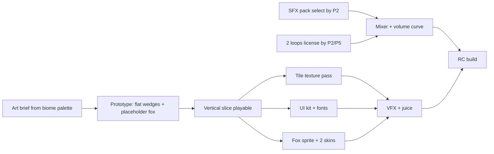
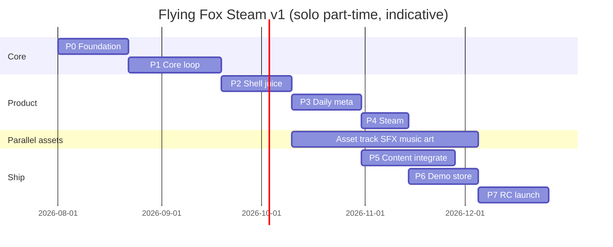
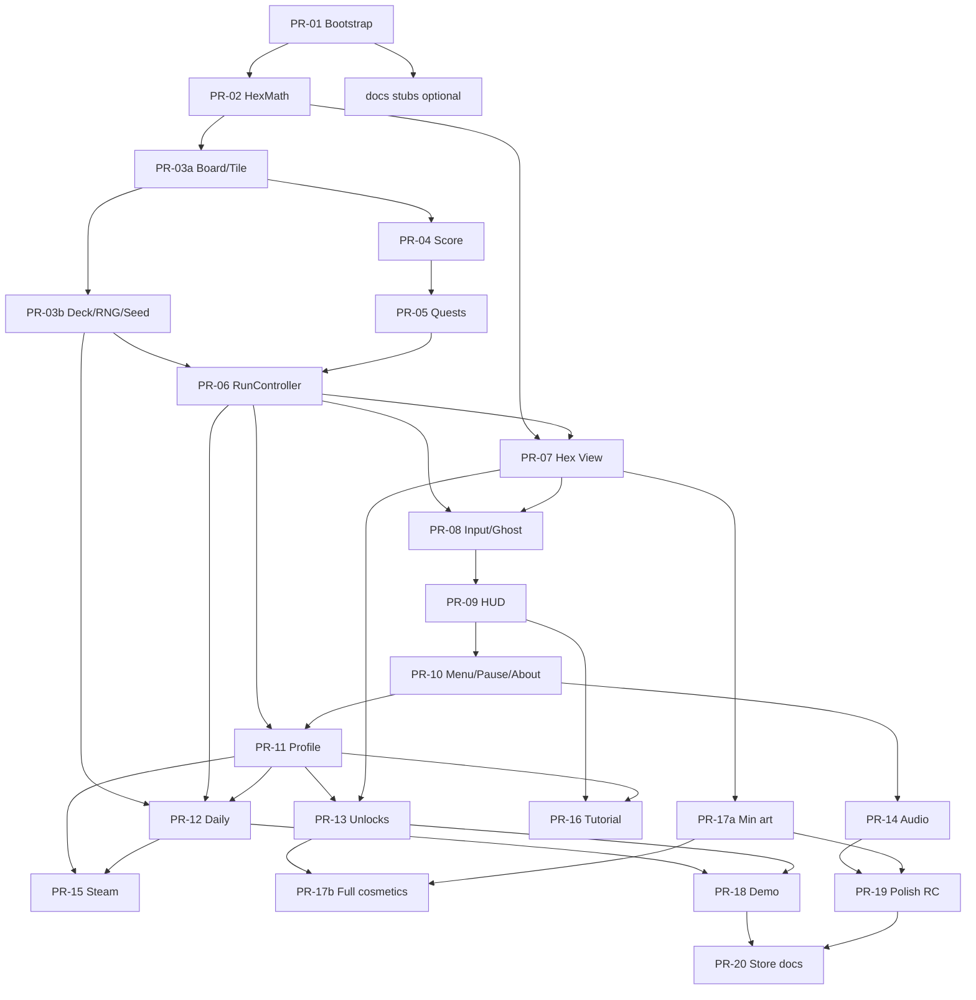

# Flying Fox Steam v1 — Product & Technical Design

| Field | Value |
|-------|--------|
| **Document title** | Flying Fox Steam v1 — Product + Technical Design |
| **Author** | David Logan (rights holder; Steam partner entity TBD before PR-20) |
| **Date** | 2026-07-30 |
| **Status** | Draft (rev 2 — review amendments) |
| **Source product** | Web + Firefox WebExtension at `/home/oem/flying-fox/` ([github.com/dglogan42/flying-fox](https://github.com/dglogan42/flying-fox)) |
| **Target product** | Unity standalone on Steam ("v1") |
| **Repo target** | `flying-fox-unity/` monorepo (new; web game remains separate) |

---

## Overview

**Flying Fox** is a cozy hex tile-laying deckbuilder: players draw from a 36-tile deck into a hand of three, rotate tiles, and grow a flat-top hex island of Forest, Meadow, Water, and Rock around a fox den, scoring edge matches and completing cluster/size quests. The current product is a zero-dependency browser game (`index.html` + `game.js` + `styles.css`) and a thin Firefox MV3 extension (`manifest.json`, `background.js`) that opens the game tab.

This document designs **Steam v1**: a Unity Windows (primary) standalone that ports the proven core loop from `game.js` with full-game polish (menus, audio, juice, light meta, Steam achievements) while **strictly cutting** multiplayer, workshop, narrative campaign, 3D world exploration, mobile stores, and extension cross-save. The goal is a 30–90 minute first-session product with high replay via Classic + Daily modes—not a 10-minute tech demo, and not an infinite content treadmill.

**Proposed solution:** Re-implement pure gameplay systems as testable C# modules mapped 1:1 from `game.js`, drive presentation with ScriptableObjects and a 2D orthographic hex renderer, ship local profile + Steam Cloud for meta/bests, and release behind a wishlist/demo funnel with a phased PR plan suitable for solo or tiny team part-time work.

---

## Background & Motivation

### Current state (web)

| System | Location | Behavior (authoritative for port) |
|--------|----------|-----------------------------------|
| Biomes | `game.js` `BIOME` / `BIOME_COLOR` | `F` Forest, `M` Meadow, `W` Water, `R` Rock |
| Grid | `EDGE_DELTA`, `OPPOSITE`, axial `q,r` | Flat-top hex; edges 0=E … 5=NE clockwise (full table in [Appendix A](#appendix-a--web-parity-constants)) |
| Deck / hand | `DECK_SIZE=36`, `HAND_SIZE=3` | 8 preset patterns + `randomEdges()` fill; shuffle |
| Hub | `startRun()` | Origin tile `["F","F","M","M","W","F"]` with fox glyph; `placed = 1` |
| Placement | `isValidPlacement`, soft mismatch | Must touch existing (or origin empty); mismatches allowed |
| Scoring | `placeTile` / README | Place +2; match +12 each; perfect (all contacts match, contacts>0) +20 |
| Breakdown | `breakdown` in `placeTile`/`endRun` | matches=`matches*12`; perfects=+20; tiles=+2 per **hand** place only; quests separate; hub adds 0 to `breakdown.tiles` |
| Quests | `makeQuests` / `largestBiomeCluster` | Forest5 +40, Water4 +35, Meadow6 +45, Island8 +25, Island16 +50 |
| Medals | `medalFor(s)` | 50 / 100 / 180 / 280 / 400 thresholds |
| Persistence | `STORAGE_KEY = "flying-fox-deck-best"` | Single best score in `localStorage` |
| UX shell | `index.html` | Title overlay, end screen breakdown, hand bar, quest panel, pan/zoom canvas |
| Extension | `manifest.json` v2.0.0 | Toolbar + Alt+Shift+F → open tab; no host perms |

Authoritative source for rules remains `game.js` (867 LOC). Appendix A freezes edge order and presets for offline implementation.

### Pain points of shipping “as-is” on Steam

1. **Platform expectation mismatch** — Canvas + emoji fox + no audio/settings reads as a web toy, not a $5–15 Steam cozy game.
2. **No discovery/meta loop** — One best score and static quests; no reason to return daily or chase cosmetics.
3. **No Steam identity** — No achievements, store presence, or controller-friendly shell.
4. **Solo shipping risk** — Open-ended “more content” will never finish; v1 needs hard cuts.

### Why Steam now

The core rules in `game.js` are small, deterministic, and already fun. Porting them into Unity with presentation/meta is a bounded engineering problem; inventing a new 3D sim is not. Steam wishlist + free demo can validate demand before art polish spikes cost. The free web game remains a **marketing funnel**, not a substitute for the paid Steam client (audio, juice, Daily, meta, achievements, offline packaged build).

---

## Goals & Non-Goals

### Goals (Steam v1)

| ID | Goal | Success signal |
|----|------|----------------|
| G1 | **Classic mode parity+** | Same rules as web (scoring, deck 36, hand 3, soft match, quests, end conditions); clearer UI; juice (place SFX, score popups, quest complete) |
| G2 | **Second mode: Daily** | Shared UTC date seed (frozen hash + PRNG); scored/practice rules; local history; comparable scores for social/store trailer |
| G3 | **Full-game shell** | Main menu, mode select, settings (audio, graphics, controls, language-ready), pause, results with breakdown + medals |
| G4 | **Light meta** | 2–3 unlockable fox skins + 2–3 table/board themes; unlock by medals or lifetime stats |
| G5 | **Steamworks slice** | App ID wired; 10 achievements; overlay; Steam Cloud for profile JSON; Windows build primary |
| G6 | **Ship feel** | Music bed + SFX set; readable hex art (not pure flat wedges alone); first session 20–45 min without feeling empty |
| G7 | **Solo-shippable** | Content budget fixed; PR plan incremental; no engine plugins that block Linux stretch |

### Non-goals (explicitly out of v1)

| ID | Non-goal | Rationale |
|----|----------|-----------|
| N1 | Multiplayer / async co-op | Scope and Steam networking cost |
| N2 | Workshop / user tile packs | Moderation + UI |
| N3 | Narrative campaign / story chapters | Writing + content volume |
| N4 | True 3D world / free-roam fox | Wrong genre bet for this loop |
| N5 | Mobile / console / Epic | Windows Steam first |
| N6 | Cross-progression with Firefox extension | Different stacks; no value for solo v1 |
| N7 | Massive tile libraries / 20 biomes | Diminishing returns vs polish |
| N8 | Live ops seasons | No ops staff |
| N9 | In-game store / MTX | Cozy premium buy-once |

### Stretch (post-v1 or if ahead of schedule)

- Linux build (Steam Deck verification)
- Endless mode (see Modes)
- Extra quest pack SO data only
- Steam leaderboards for Daily
- Controller glyph remapping polish
- Mid-run save/resume for Deck suspend

---

## Modes

### MVP modes

#### 1. Classic (required)

- **Rules:** Port of `startRun` / `buildDeck` / `placeTile` / `makeQuests` / `endRun`.
- **End conditions** (full port of `placeTile` + `endRun` in `game.js`):
  1. **Natural complete (primary):** `deck.Count == 0 && hand.Count == 0` → “Canopy complete”.
  2. **Defensive no-space branch (parity):** if `hand.Count > 0` and `getEmptyAdjacent().Count == 0` → also natural end. On an open hex grid this is effectively unreachable (perimeter always grows), but the branch is implemented for faithfulness and unit tests.
  3. **Manual abandon:** New run / quit from pause → “Run ended” (`natural == false`); still shows score/breakdown; **does** count for best-score / stats / unlocks / achievements if the run was a scored session (not practice). Optional: only count `natural` for “complete a run” achievements — **decision: scored abandon still updates bests and lifetime stats; `FF_FIRST_CANOPY` / `FF_EMPTY_DECK` require natural end with empty deck+hand.**
  4. **Quests:** leftover quests **never** auto-complete at end (`// leftover quests don't auto-complete` in web).
- **Soft placement:** Always allowed on empty-adjacent cells; mismatches score less (no hard block).
- **RNG:** Fresh seed each run via `IRng.Reseed` from a time-derived or explicit debug seed; seed stored on `RunResult` for bug reports.
- **Progression hooks:** Score → medals → unlock checks; lifetime counters (see profile mutation rules).
- **Target session:** ~8–20 minutes per run depending on player speed.

#### 2. Daily (required second mode — **chosen over Endless for v1**)

| Criterion | Daily | Endless (deferred) |
|-----------|-------|---------------------|
| Replay structure | One meaningful run per day | Open-ended; hard to balance medals |
| Social / marketing | “Beat today’s island” clips | Less comparable |
| Implementation | Frozen UTC seed → deterministic deck + hub | Needs new fail conditions, scoring curves |
| Steam achievements | “7-day streak,” Daily complete | Harder to define “complete” |
| Scope | Low delta on Classic | Medium–high |

**Daily calendar (locked):**

- **Seed key, `bestByDate` key, and streak calendar all use UTC `YYYY-MM-DD`.** Local timezone is display-only (“Daily — 30 Jul 2026” via player locale).
- A player in UTC−10 who plays Monday 20:00 local is still keyed to that moment’s **UTC** date for seed, best, and streak.

**Daily seed + PRNG contract (locked — KD14):**

1. Canonical string: `FlyingFoxDaily|` + `utcDate` where `utcDate` is `yyyy-MM-dd` (e.g. `FlyingFoxDaily|2026-07-30`).
2. Compute **SHA-256** over **UTF-8** bytes of that string.
3. Seed = first **4 bytes**, interpreted as **little-endian signed 32-bit** (`int` / `Int32`). Example vectors:

| UTC date | Seed (`int`) |
|----------|-------------:|
| `2026-01-01` | `1676240494` |
| `2026-07-30` | `-1958845361` |
| `2026-12-31` | `-2015936422` |
| `2027-02-28` | `1202516165` |
| `2030-06-15` | `1709004978` |

4. **PRNG:** All deck generation for Daily (and Classic when replaying a seed) goes through `IRng` implemented as **`SplitMix64`** (public-domain algorithm; documented in `SplitMix64Rng.cs` comments). **Do not** use `string.GetHashCode()`, `System.Random` default constructor, or .NET-version-dependent algorithms for Daily. `IRng.Reseed(seed)` zeros/sets state from the `int` seed (sign-extend to `ulong` as `unchecked((ulong)(uint)seed)` then mix once).
5. **Golden deck fixtures:** EditMode tests publish at least 3 dates → seed → first 5 tile edge arrays after `DeckFactory.Build` (presets + RNG fill + shuffle using only `IRng`). Fixtures live under `Assets/Tests/EditMode/Fixtures/DailySeeds.json`.

**Daily run rules:**

- Same 36-tile deck construction path, same hub, same quests as Classic.
- **Scored vs practice:** First finished run on a given UTC date that is not already marked scored is **scored**. Any subsequent finish that UTC day is **practice** (UI banner).
  - Scored: may overwrite `daily.bestByDate[date]` if score is **strictly greater**; always updates streak rules below.
  - Practice: **never** updates `bestByDate`, streak, lifetime stats, unlocks, or Steam achievements.
- **Streak:** After a **scored** finish on UTC date `D`, if `lastScoredUtcDate` is `D-1` day, `streak++`; else if already `D`, unchanged; else `streak = 1`. Set `lastScoredUtcDate = D`. Missed days break the streak on next scored play (no retroactive fill).
- No global leaderboard for v1 (local only); schema-ready for later.

### Stretch mode (not committed)

#### Endless

- Infinite reshuffle or continuous draw after 36; score until player quits; separate medal table. **Out of v1** unless Classic + Daily ship early.

### Mode selection UX

```
Main Menu
├── Classic
├── Daily (shows today’s UTC date + personal best today)
├── Collection (fox skins / themes — unlock status)
├── Settings (includes About: version / build / seed tools)
└── Quit
```

### Mode eligibility for medals, unlocks, achievements

| Effect | Classic scored | Daily scored | Daily practice | Abandoned scored run |
|--------|:--------------:|:------------:|:--------------:|:--------------------:|
| Update `bestClassic` / `bestDaily` | ✓ | ✓ | ✗ | ✓ if higher |
| Lifetime counters (`tilesPlaced`, etc.) | ✓ | ✓ | ✗ | ✓ (partial progress counted) |
| Medals (end screen + profile high-water) | ✓ | ✓ | display only, no profile | ✓ |
| Score-tier achievements (`FF_BIRCH`, etc.) | ✓ | ✓ | ✗ | ✓ if threshold met |
| `FF_FIRST_CANOPY`, `FF_EMPTY_DECK` | natural complete only | natural complete only | ✗ | ✗ |
| `FF_DAILY_*` | ✗ | ✓ | ✗ | Daily natural or finish rules per achievement |
| Unlocks: Birch fox / Golden fox | ✓ either mode | ✓ | ✗ | ✓ if condition met |
| Unlock: Moonlit table (all quests Classic) | ✓ Classic only | ✗ | ✗ | ✓ Classic if all quests done that run |
| Unlock: Starry (5 Daily **scored** finishes) | ✗ | ✓ | ✗ | counts if scored Daily finish |

---

## Gameplay Systems

### Port map: `game.js` → Unity systems

| Web function / constant | Unity module | Notes |
|-------------------------|--------------|-------|
| `BIOME`, `BIOME_LIST` | `BiomeId` enum | `Forest, Meadow, Water, Rock` |
| `EDGE_DELTA`, `OPPOSITE` | `HexMath` static | Pure C#; unit tests; Appendix A |
| `key(q,r)`, `hexToPixel`, `pixelToHex`, `axialRound` | `HexMath` | Flat-top; configurable `hexSize` |
| `makeTile`, `rotateEdges` | `TileData` / `TileInstance` | Edges as `BiomeId[6]` |
| `randomEdges`, `buildDeck`, presets | `DeckFactory` + `TilePresetLibrary` SO | Presets from Appendix A; weights 0.35 / 0.55 / 0.7 |
| `drawToHand` | `RunState.DrawToHand` | Hand size 3 |
| `getEmptyAdjacent`, `isValidPlacement` | `BoardModel` | `Dictionary<HexCoord, PlacedTile>` |
| `evaluatePlacement`, `placeTile` | `PlacementService` + `ScoreService` | Soft mismatch; scoring constants as config SO |
| `largestBiomeCluster` | `BiomeClusterAnalyzer` | Edge-node graph BFS; critical to unit-test |
| `makeQuests`, `checkQuests` | `QuestRuntime` + `QuestDefinition` SO | 5 quests parity |
| `medalFor` | `MedalService` | Threshold table SO |
| `startRun` / `endRun` | `RunController` | State machine; full end rules above |
| Camera pan/zoom | `MapCameraController` | Orthographic; zoom clamp **0.45–2.4** |
| Canvas paint | `HexTileView` + materials | Procedural mesh wedges or sprite atlas |
| `localStorage` best | `IProfileStore` | JSON under `Application.persistentDataPath` + optional Steam Cloud |

### Scoring (locked for parity)

| Event | Points | Source |
|-------|-------:|--------|
| Place tile (from hand only) | +2 | `placeTile` base; hub free |
| Matching edge | +12 each | `matches * 12` |
| Perfect placement | +20 | `matches == contacts && contacts > 0` |
| Quest rewards | +25–50 | Per quest definition |

**Design rule:** Do not change these numbers for v1 without an A/B playtest flag. Store them in `GameBalanceConfig` ScriptableObject so balance tweaks are data, not recompiles.

### Score total vs breakdown (web parity)

Port the **breakdown + `score`** fields, not the dead `matchPoints` accumulator (web incorrectly folds base+perfect into `matchPoints` but never displays it).

| Breakdown field | Accumulation | Notes |
|-----------------|--------------|-------|
| `matches` | `+= matches * 12` per hand placement | Edge match points only |
| `perfects` | `+= 20` when perfect | Not folded into matches |
| `tiles` | `+= 2` per hand placement | **Hub does not contribute** (`placed` counter starts at 1; breakdown.tiles stays 0 until first hand place) |
| `quests` | `+= reward` when quest completes mid-run | Incomplete quests at end contribute 0 |

**Invariant (acceptance test):** for any finished run,

```text
score == breakdown.tiles + breakdown.matches + breakdown.perfects + breakdown.quests
```

Hub placement sets map cell and `placed = 1` but adds **0** to score and breakdown (matches `startRun` in `game.js`).

### Quests (v1 content = web parity + SO extensibility)

| ID | Title | Condition | Reward |
|----|-------|-----------|-------:|
| `forest5` | Fox Den | Largest forest edge-cluster ≥ 5 | 40 |
| `water4` | River Run | Largest water edge-cluster ≥ 4 | 35 |
| `meadow6` | Sunlit Glade | Largest meadow edge-cluster ≥ 6 | 45 |
| `island8` | Home Island | Map size ≥ 8 | 25 |
| `island16` | Canopy Realm | Map size ≥ 16 | 50 |

Cluster definition must match web: graph of biome-matching **edges** (nodes `tileKey:edgeIndex`), edges linked to (a) same-tile adjacent edges of same biome and (b) neighbor opposite edge when that edge matches biome; BFS component size = **count of edge nodes**, not unique tiles (`game.js` `largestBiomeCluster`).

**Mandatory EditMode fixtures (PR-05):**

1. Hub only `["F","F","M","M","W","F"]` → forest cluster size **3** (edges 0,1,5 form one component via same-tile adjacency; water 1; meadow 2).
2. Single mono-forest tile 6×F alone → forest cluster **6**.
3. Two tiles sharing one matched forest edge → forest component includes both edge nodes (≥2); document exact count from BFS.
4. Two adjacent tiles with non-matching forest edges → components do **not** merge across the contact.
5. Island size quests use `map.Count` (hub-only progress = 1).
6. Full micro-run ending with unfinished quests → rewards not granted; `score` invariant holds.

Label fixtures with web reference (`game.js` / commit when available). Optional: tiny Node harness extracting cluster logic — not required if hand-verified fixtures exist.

### Medals (parity)

| Min score | Medal key | Display name (draft) |
|----------:|-----------|----------------------|
| 50 | Sapling | Sapling Grove |
| 100 | Birch | Birch Leaf |
| 180 | Pine | Pine Badge |
| 280 | Oak | Oak Crown |
| 400 | Golden | Golden Fox |

Medals feed **meta unlocks** and Steam achievements (not only end-screen fluff). Profile stores high-water medal enum and `goldenFoxCount` (see mutation rules).

### Extensions beyond web (v1 meta)

| Feature | Behavior |
|---------|----------|
| Lifetime stats | See full profile schema + mutation rules |
| Unlocks | Fox skins / table themes; eligibility table above |
| Achievements | Steamworks section; same eligibility table |
| Score preview | Keep web hover preview (`+pts`, `matches/contacts`) — critical feel |
| Ghost tile | Keep ghost placement on hover |
| Results breakdown | Matches / perfects / quests / tile base with hub exclusion |

### What not to port as-is

- DOM/canvas rendering (`paintHexTile` canvas path) → Unity mesh/UI.
- Emoji fox as long-term art → replace with sprite; keep emoji only as prototype placeholder.
- `confirm()` new-run dialog → proper modal (pause-safe).
- Extension `background.js` — no Steam equivalent.
- Web `matchPoints` variable — do not port; use breakdown + score only.

---

## Unity Architecture

### Engine & packages (v1) — pinned

| Choice | **Locked decision** |
|--------|---------------------|
| Unity LTS | **Hard gate at PR-01:** pin either **Unity 6 LTS** or **2022.3 LTS** in repo README the day the project is created; do not dual-support. Prefer **Unity 6 LTS** if available to the author at P0; otherwise 2022.3 LTS. Record exact version string (e.g. `6000.0.xxf1`). |
| Render pipeline | **URP 2D** |
| Input | **Input System** package (KBM + gamepad) |
| UI | **UI Toolkit for all game UI** (menus, HUD, results, pause, collection, tutorial). No UGUI hybrid in v1. |
| Steam | **`com.rlabrecque.steamworks.net`** (Steamworks.NET) exclusively. Facepunch rejected for v1 to avoid dual wrappers (see Alternatives). |
| Audio | Built-in AudioSource + mixer groups (Master / Music / SFX) |
| Save | **`System.Text.Json`** (no Newtonsoft dependency). Path: `Path.Combine(Application.persistentDataPath, "profile.json")` — works for Windows and Linux/Deck stretch. |
| Composition | **Minimal `AppRoot` service registry** (construct-on-boot, static or scene-rooted accessors). No Zenject/VContainer/full DI framework. |
| Tests | EditMode tests for `HexMath`, `DeckFactory`, `BiomeClusterAnalyzer`, `ScoreService`, Daily seeds |

### Folder structure (proposed monorepo)

```
flying-fox-unity/
├── README.md
├── docs/
│   ├── design/                    # this doc + balance notes
│   ├── STEAM_CHECKLIST.md         # living from early PRs
│   └── THIRD_PARTY.md
├── ProjectSettings/
├── Packages/
├── Assets/
│   ├── _Project/
│   │   ├── Art/
│   │   │   ├── Biomes/
│   │   │   ├── Fox/
│   │   │   ├── UI/
│   │   │   └── VFX/
│   │   ├── Audio/
│   │   │   ├── Music/
│   │   │   └── SFX/
│   │   ├── Data/                  # ScriptableObjects instances
│   │   │   ├── Balance/
│   │   │   ├── Quests/
│   │   │   ├── Tiles/
│   │   │   ├── Unlocks/
│   │   │   └── Achievements/
│   │   ├── Prefabs/
│   │   │   ├── Hex/
│   │   │   ├── UI/
│   │   │   └── VFX/
│   │   ├── Scenes/
│   │   │   ├── Boot.unity
│   │   │   ├── MainMenu.unity
│   │   │   └── Game.unity
│   │   ├── Scripts/
│   │   │   ├── Core/              # pure C# gameplay (no UnityEngine)
│   │   │   │   ├── Hex/
│   │   │   │   ├── Board/
│   │   │   │   ├── Deck/
│   │   │   │   ├── Rng/
│   │   │   │   ├── Placement/
│   │   │   │   ├── Score/
│   │   │   │   ├── Quests/
│   │   │   │   └── Run/
│   │   │   ├── Presentation/      # MonoBehaviours, views
│   │   │   ├── UI/                # UI Toolkit controllers
│   │   │   ├── Meta/              # profile, unlocks
│   │   │   ├── Steam/
│   │   │   ├── Audio/
│   │   │   └── App/               # AppRoot, scene flow, settings
│   │   └── Settings/              # URP, Input Actions, AudioMixer
│   └── Tests/
│       └── EditMode/
│           └── Fixtures/
└── Tools/                         # optional CI; optional JS fixture exporter notes
```

### Core C# module sketch

```csharp
// Assets/_Project/Scripts/Core/Hex/HexCoord.cs
public readonly struct HexCoord : IEquatable<HexCoord>
{
    public readonly int Q, R;
    public HexCoord(int q, int r) { Q = q; R = r; }
    public string Key => $"{Q},{R}"; // parity with game.js key()
}

// Assets/_Project/Scripts/Core/Rng/IRng.cs
public interface IRng
{
    void Reseed(int seed);
    int Next(int minInclusive, int maxExclusive);
    float NextFloat(); // [0,1)
}

// Assets/_Project/Scripts/Core/Score/ScoreService.cs
public static class ScoreService
{
    public static PlacementScore Evaluate(
        BoardModel board, HexCoord at, BiomeId[] edges, GameBalanceConfig bal)
    {
        // Port evaluatePlacement + place score formula from game.js
    }
}

// Assets/_Project/Scripts/Core/Score/ScoreBreakdown.cs
public sealed class ScoreBreakdown
{
    public int Matches;   // sum of matches*12
    public int Perfects;  // sum of +20
    public int Tiles;     // sum of +2 hand places only
    public int Quests;
    public int Total => Matches + Perfects + Tiles + Quests;
}
```

**Separation rule:** `Core/` has **zero** `UnityEngine` references. Enables EditMode tests and headless Daily seed tools.

### Scene flow



- **Boot:** `AppRoot` registers services (profile load, Steam init if `FF_STEAM`, audio mixer, input), then load MainMenu.
- **MainMenu:** Mode select, collection, settings, quit.
- **Game:** Single scene for both modes; mode params via `RunConfig` (seed, mode id, scored/practice, quest set). Results are an overlay, not a scene switch.

### Runtime architecture



### Key MonoBehaviours vs pure logic

| Concern | Pure C# | MonoBehaviour / UI Toolkit |
|---------|---------|----------------------------|
| Board state | `BoardModel` | `HexMapView` spawns/pools tile views |
| Input map click → hex | `HexMath.PixelToHex` | `MapInputController` |
| Run lifecycle | `RunController` | `GameSessionDriver` |
| Unlocks | `UnlockEvaluator` | Collection UI binds to profile |
| Services | interfaces | `AppRoot` constructs implementations |

### ScriptableObject data

| SO type | Purpose |
|---------|---------|
| `GameBalanceConfig` | Place/match/perfect points, hand/deck size, zoom limits 0.45–2.4 |
| `TilePresetLibrary` | 8 web presets + generation weights (0.35 / 0.55 / 0.7) |
| `QuestDefinition` | Id, title, desc, target, reward, type, biome |
| `QuestSet` | Classic/Daily shared set of 5 |
| `MedalTable` | Thresholds + localization keys |
| `UnlockDefinition` | Cosmetic id, type (FoxSkin / TableTheme), condition |
| `BiomeVisualConfig` | Colors, edge materials, optional patterns |
| `AudioCueLibrary` | Place, perfect, mismatch-soft, quest, medal, UI click |

### Determinism (Daily)



Hub edges remain fixed as web for v1 (`F,F,M,M,W,F`) so Daily variance is deck-only.

---

## API / Interface Changes

No public web API. Internal interfaces for testability and Steam swapping:

```csharp
public interface IProfileStore
{
    PlayerProfile Load();
    void Save(PlayerProfile profile);
}

public interface IAchievementGateway
{
    void Unlock(string achievementApiName);
    void SetStat(string statName, int value);
    void Store();
}

public interface IRng
{
    void Reseed(int seed);
    int Next(int minInclusive, int maxExclusive);
    float NextFloat(); // [0,1)
}

/// <summary>Raised by RunController / ProfileService; Steam listens without needing unlock cosmetics.</summary>
public interface IRunStatsSink
{
    void OnRunFinished(RunResult result);
}
```

- **Editor / offline:** `NullAchievementGateway`, `FileProfileStore` (`persistentDataPath`), `SplitMix64Rng`.
- **Steam build (`FF_STEAM`):** `SteamAchievementGateway`, file store + `SteamCloudProfileStore` sync wrapper.

### Input actions (v1)

On-screen **Rotate** and **Cycle** buttons remain in the HUD for discoverability (web parity with `#btn-rotate` / `#btn-cycle`).

| Action | Keyboard/Mouse | Gamepad |
|--------|----------------|---------|
| Select hand 1–3 | `1` / `2` / `3` | D-pad left/right (cycle focus); optional face-button hold unused |
| Cycle hand | `Tab` / `Shift+Tab`; HUD Cycle | **LB / RB** |
| Rotate CW / CCW | `R` / `Q`; HUD Rotate | **X = CW, Y = CCW** (or Y/X if platform glyph norms require; document in settings) |
| Place | LMB on valid hex | **A** places on currently highlighted empty hex |
| Cancel / deselect hover | — | **B** clears placement highlight |
| Pan | Drag on map | Right stick |
| Zoom | Scroll | LT / RT |
| Pause | `Esc` | **Start** |
| Confirm modal | Enter | **A** |
| Cancel modal | `Esc` | **B** |

**Pause behavior (v1):** input freeze + modal overlay (Resume / New run / Settings / Quit to menu). Does **not** serialize mid-run. Time scale may stay 1 (turn-based; no simulation clock). New run from pause uses the same confirm modal as web’s `confirm()` replacement.

---

## Data Model Changes

### Player profile (JSON) — complete v1 schema

```json
{
  "version": 1,
  "hasSeenTutorial": false,
  "bestClassic": 0,
  "bestDaily": 0,
  "highestMedal": "None",
  "lifetime": {
    "runsCompleted": 0,
    "runsAbandoned": 0,
    "tilesPlaced": 0,
    "perfectPlacements": 0,
    "edgeMatches": 0,
    "questsCompleted": 0,
    "goldenFoxCount": 0,
    "dailyScoredFinishes": 0
  },
  "unlocks": ["fox_default", "table_default"],
  "equippedFox": "fox_default",
  "equippedTable": "table_default",
  "daily": {
    "lastScoredUtcDate": null,
    "streak": 0,
    "bestByDate": {}
  },
  "settings": {
    "masterVolume": 1.0,
    "musicVolume": 0.7,
    "sfxVolume": 1.0,
    "shake": true,
    "colorblindPatterns": false
  }
}
```

| Field | Meaning |
|-------|---------|
| `hasSeenTutorial` | Set true when tutorial finished or skipped (PR-16) |
| `bestClassic` | Max score over scored Classic finishes |
| `bestDaily` | Max score over scored Daily finishes (**also** `max(bestByDate.values)`; keep denormalized for O(1) menu display; both updated together) |
| `highestMedal` | High-water medal key from any scored run |
| `lifetime.runsCompleted` | Scored finishes that reached an end screen (natural or abandon) |
| `lifetime.runsAbandoned` | Subset: non-natural ends |
| `lifetime.tilesPlaced` | Sum of hand tiles placed across scored runs (not hub) |
| `lifetime.perfectPlacements` | Cumulative perfects (scored runs) |
| `lifetime.edgeMatches` | Cumulative match **count** (edges), for stats; achievements may use per-run |
| `lifetime.questsCompleted` | Cumulative quest completions |
| `lifetime.goldenFoxCount` | Increment **once per scored run** that ends with score ≥ 400 (not once lifetime only—counts how many Golden Fox runs) |
| `lifetime.dailyScoredFinishes` | Count of scored Daily finishes (unlock Starry Night at ≥ 5) |
| `daily.lastScoredUtcDate` | UTC `yyyy-MM-dd` of last scored Daily |
| `daily.streak` | Consecutive UTC days with ≥1 scored Daily finish |
| `daily.bestByDate` | Map UTC date → best scored score that day |

### Profile mutation rules (single place of truth)

Applied by `ProfileService.ApplyRunResult(RunResult r)`:

1. If `r.IsPractice` → **return immediately** (no mutations except optional local UI history not in profile).
2. Increment `runsCompleted`; if `!r.NaturalEnd` also `runsAbandoned++`.
3. Add run totals into lifetime counters (`tilesPlaced`, `perfectPlacements`, `edgeMatches`, `questsCompleted`).
4. If `r.Mode == Classic` and `r.Score > bestClassic` → update `bestClassic`.
5. If `r.Mode == Daily` and scored: update streak; if `r.Score > bestByDate[date]` update map; set `bestDaily = max(bestDaily, r.Score)`; `dailyScoredFinishes++` on every scored Daily finish.
6. Update `highestMedal` if `medalFor(r.Score)` is higher.
7. If `r.Score >= 400` → `goldenFoxCount++`.
8. Run `UnlockEvaluator` then queue achievement events via `IRunStatsSink` / gateway.
9. `Save()` profile (local + cloud if enabled).

### Migration strategy

- `version` field; `ProfileMigrator` chain (v1 only at launch).
- Corrupt file → backup `.bak` + fresh profile; never crash boot.
- Steam Cloud conflict = take max of numeric bests / union unlocks / max streak only if same `lastScoredUtcDate` logic allows (prefer player-friendly merge of bests + unlocks; streak = max if dates compatible, else keep newer `lastScoredUtcDate` side).

### Board runtime (not persisted mid-run for v1)

v1 does **not** require mid-run save/resume (stretch). Pause does not serialize.

---

## Content Budget (v1)

Realistic solo/small-team ceiling:

| Category | v1 quantity | Notes |
|----------|-------------|-------|
| Biomes | 4 | Forest, Meadow, Water, Rock — parity |
| Tile generation | 8 presets + weighted RNG | Port `buildDeck` / `randomEdges` |
| Quest set | 5 | Web parity; SO-ready for +2 later without code |
| Modes | 2 | Classic + Daily |
| Fox skins | **3 total** | Default + 2 unlocks (Autumn Scarf, Starry Night) |
| Table / board themes | **3 total** | Default wood + 2 (Moonlit, Mossy Stone) |
| Music tracks | **2** | Menu + in-run; **default path: commercial-friendly licensed/CC0 loops** selected by end of P2; commission only if budget approved (Open Question) |
| SFX | **12–20** | Prefer CC0 packs (e.g. publicly documented free SFX libraries with commercial use) by P2 |
| Achievement icons | **10** | Simple silhouette/badge set; placeholder geometric icons acceptable for demo; final art before RC |
| Medals | 5 tiers | Parity thresholds |
| Steam achievements | **10** | Locked list below |
| Locales | **1** (English) | String tables ready for EN only |
| Tutorial | Lightweight | First-run coach marks / 3-step overlay |

### Unlock matrix (draft)

| Unlock | Condition | Modes |
|--------|-----------|-------|
| Fox: Autumn Scarf | Earn Birch Leaf (score ≥ 100) once | Classic or Daily scored |
| Fox: Starry Night | `dailyScoredFinishes ≥ 5` **or** one Golden Fox run | Daily scored / either for Golden |
| Table: Moonlit | Complete all 5 quests in a single **Classic** scored run | Classic only |
| Table: Mossy Stone | Lifetime 100 perfect placements | Either scored mode |

Keep conditions transparent in Collection UI (“How to unlock”).

### Art direction (minimal shippable)

- **Look:** Soft vignette canopy palette (web CSS greens: deep green `#1a3a2a`-family, cream text).
- **Tiles:** Procedural wedge fills OK for prototype; v1 should add **subtle texture/noise per biome** + optional edge icons for colorblind mode.
- **Fox:** Single base sprite + 2 recolors/accessories as skins.
- **VFX:** Place pulse (web `lastPlace` scale anim), score floater, quest checkmark burst.
- **Avoid:** Photoreal leaves, particle soup that tanks Steam Deck.
- **Placeholder ship:** Public demo may use greybox tiles + placeholder fox if PR-17b (min art bar) not ready; store **screenshots/trailer must wait** for min art bar (see roadmap).

### Audio pipeline

| Step | Tooling |
|------|---------|
| SFX | CC0/licensed pack + light processing (Audacity); **select pack by end of P2** |
| Music | Licensed/CC0 cozy loops with Steam commercial rights by default; commission optional |
| Integration | AudioMixer groups; duck music slightly on place SFX optional |
| Settings | Independent Music/SFX sliders |
| Blockers | If licensing slips → **ship with placeholders** + free post-launch audio patch (see risks) |

---

## Steamworks Scope

| Item | v1 decision |
|------|-------------|
| App ID | Create Steamworks app when prototype playable; use `480` Spacewar only for early integration tests |
| Platforms | **Windows x64 primary**; Linux = stretch (same Unity player) |
| Steam Deck | Target **Deck Verified** checklist (input, resolution, default settings) |
| Overlay | Enabled |
| Achievements | **10** (locked table below) |
| Stats | Optional int stats for progress achievements |
| Cloud | **Yes, light** — profile JSON only (~few KB) |
| Leaderboards | **No for v1** |
| Rich presence | Optional: “Classic run” / “Daily 2026-07-30” |
| DLC / MTX | None |
| Workshop | None |
| VAC | N/A |
| Wrapper | **Steamworks.NET** only |

### Achievements (locked, 10)

| API name | Display name | Description | Trigger |
|----------|--------------|-------------|---------|
| `FF_FIRST_CANOPY` | First Canopy | Complete a Classic canopy | Natural Classic end with `deck==0 && hand==0` |
| `FF_BIRCH` | Birch Leaf | Score 100+ in a single run | Scored run, either mode, score ≥ 100 |
| `FF_OAK` | Oak Crown | Score 280+ in a single run | Scored run, either mode, score ≥ 280 |
| `FF_GOLDEN_FOX` | Golden Fox | Score 400+ in a single run | Scored run, either mode, score ≥ 400 |
| `FF_PERFECT_TEN` | Perfect Ten | 10 perfect placements in one run | Scored run, either mode |
| `FF_QUEST_MASTER` | Quest Master | Complete all quests in one run | Scored run, either mode, all 5 done |
| `FF_DAILY_FIRST` | Morning Dew | Finish a scored Daily run | First scored Daily natural or any scored Daily finish — **decision: any scored Daily finish** |
| `FF_DAILY_WEEK` | Week in the Woods | 7-day Daily streak | `streak ≥ 7` after scored Daily |
| `FF_MATCHMAKER` | Matchmaker | 50 edge matches in one run | Per-run match **count** ≥ 50 (edges matched, not points) |
| `FF_EMPTY_DECK` | Empty Deck | Empty the deck and hand | Natural end with `deck.Count==0 && hand.Count==0` (Classic or Daily scored). **Not** `placed ≥ 36`. Hub means map size 37 when full. |

`FF_HOMESTEAD` is **removed** from v1 to eliminate hub/`placed` ambiguity.

---

## IP & Licensing

| Asset / code | Policy |
|--------------|--------|
| Web game `flying-fox` (MIT, Copyright 2026 David Logan) | Remains MIT; rules/logic may be reimplemented in Unity |
| Unity project `flying-fox-unity` | **Proprietary binary/assets for Steam** unless author chooses otherwise; source license separate from Steam depot |
| Third-party fonts/audio/art | Track in `docs/THIRD_PARTY.md` with commercial Steam rights before RC |
| Store IP claims | Author / rights holder fills Steam partner questionnaire before PR-20 store push |
| Competitor names | Internal design only; **never** on Steam store page |

---

## Art / Audio Pipeline (minimal)



**Parallel asset track:** SFX/music selection and achievement icon silhouettes run **in parallel** from P2, not only inside P5. P5 is integration + final polish. Acceptance: **placeholder audio/art may ship** if rights clear; store trailer waits on min art bar (PR-17a).

**Rules of engagement for solo:**

1. **Greybox first** — shippable code with placeholder art beats beautiful unplayable menus.
2. One **UI font** pair with free commercial license.
3. Export checklist: compression presets for Windows; 1080p UI reference.
4. Colorblind: patterns or edge icons toggle (`colorblindPatterns`).

---

## Store Page / Wishlist / Demo Strategy

### Positioning (store copy principles)

- Lead with **fantasy + verb**: grow a hex island for a fox; rotate tiles; match edges; finish quests.
- Emphasize **cozy, thoughtful, sessionable** (10–20 min runs).
- **Do not name-drop** competitor titles on the store page.
- Avoid “web port” language; show Unity juice footage.
- **Why paid vs free web:** packaged offline client, full audio, juice/VFX, Daily challenges, cosmetic meta, Steam achievements/cloud — free web remains a taste-test funnel, not feature parity.

### Funnel

| Phase | Actions |
|-------|---------|
| **T-8–12 weeks** | Steamworks page live (Coming Soon); capsule + screenshots from **min art bar**; wishlist CTA; careful web cross-promo |
| **T-4–6 weeks** | **Demo** depot (`FF_DEMO`): Classic only, unlimited playtime |
| **T-2 weeks** | Trailer; press kit; limited keys if desired |
| **Launch** | Full build; optional launch discount |
| **Post** | Art/audio patch if placeholders; Linux stretch |

### Demo scope (hard cut)

- Classic only, full rules (`FF_DEMO` compile strip of Daily/meta/Steam optional).
- No Daily (protects seed novelty).
- No Collection unlocks (or cosmetics locked showcase).
- Unlimited playtime.
- **Screenshots/trailer:** not published until PR-17a min art bar (textured biomes + non-emoji fox + basic UI skin). Code-complete demo for friends may still use placeholders.

### Pricing (guidance only)

- Band often **$4.99–$9.99**. Final price after demo feedback; no live-ops revenue.

---

## Security & Privacy Considerations

| Topic | Approach |
|-------|----------|
| Network | None required for gameplay; Steamworks client APIs only |
| PII | No accounts beyond Steam; no analytics SDK required for v1 |
| Saves | `Application.persistentDataPath` + optional Steam Cloud; no third-party cloud |
| Mods | Not supported; do not load arbitrary assemblies |
| Telemetry | Optional anonymous Steam achievement stats only |
| Cheating | Singleplayer; client-authoritative OK for cozy |
| Licenses | `docs/THIRD_PARTY.md` for Steam questionnaire |

### Threat model (lightweight)

- **Malicious save edit:** Acceptable for singleplayer.
- **Seed manipulation Daily:** Local integrity only unless leaderboards added later.

---

## Observability

| Layer | v1 practice |
|-------|-------------|
| Logging | Gated logs; Unity `Player.log`; soft-fail save/Steam init |
| Metrics (dev) | Editor overlay: FPS, hex under cursor, seed, placement eval |
| Crash | Default Unity handler; optional Cloud Diagnostics later |
| Player support | Results + Settings → **About**: `Application.version`, build/git number (injected at CI), mode, UTC daily date, seed `int`, path hint to Player.log; **Copy debug info** button |
| Alerts | Post-launch: Steam reviews + discussions |

**Key events (optional local):** run_start, run_end (score, mode, seed, natural), achievement_unlock, cloud_sync_fail.

---

## Rollout Plan

### Compile defines vs runtime flags (locked)

| Mechanism | What it gates | Ship in release player? |
|-----------|---------------|-------------------------|
| `FF_STEAM` | Steamworks package init, cloud, achievement gateway | Yes on Steam depot; off for pure offline editor tests |
| `FF_DEMO` | Strips/hides Daily, Collection unlocks, full achievement set as needed | Demo depot only |
| Profile `settings.*` | colorblind, shake, volumes | Yes — player-facing |
| `FeatureFlags` **dev-only** class | Force Daily on/off, mock cloud, Endless experimental | **Editor / Development Build only** — not a release cheat menu |

```csharp
// Editor / Development Build only — not exposed in release UI
public sealed class DevFeatureFlags
{
    public bool ForceDailyEnabled = true;
    public bool MockSteamCloud = false;
    // EndlessMode = false until stretch
}
```

Demo gates Daily via **`#if !FF_DEMO`** (dead-strip), not a runtime toggle players can flip.

### Staged rollout

1. **Internal playable** — Classic only, placeholders.
2. **Friends branch** — Daily + meta; Steam achievements in test app.
3. **Demo depot** — public after min art bar for store assets.
4. **Release candidate** — content lock; bugfix only.
5. **Launch default branch** — Windows.

### Rollback

- Steam builds: previous depot retained; switch default build.
- Profile: versioned; backup on migrate.

### Risk severity table

| Risk | Severity | Likelihood | Mitigation |
|------|----------|------------|------------|
| Scope creep (Endless, more biomes, story) | **High** | High | Non-goals list; PR plan freeze for v1 content |
| “Feels like a web port” | **High** | Medium | Juice budget, audio, fox art, main menu; store waits on min art |
| Cluster scoring mismatch vs web | **Med** | Medium | Mandatory fixtures PR-05; optional JS dual-check |
| Daily seed disagreement across platforms | **Med** | Low | SHA-256 + SplitMix64 + golden vectors |
| Steam API init failures | **Med** | Medium | Offline graceful degrade; achievement queue |
| Solo burnout / estimate overrun | **High** | High | Part-time phased roadmap; demo early; split large PRs |
| **Asset licensing / delivery delay** | **High** | Medium | CC0 path by P2; **placeholder ship + post-launch art/audio patch** |
| Legal/inspiration marketing claims | **Med** | Low | No competitor names on store; original assets |
| Performance on low-end / Deck | **Low** | Medium | Cap particles; pool hex views |
| Audio licensing mistake | **Med** | Low | Commercial rights checklist before RC |

---

## Phased Roadmap (solo part-time)

Assumptions: ~10–15 focused hours/week; one generalist who can do light art; Unity familiar. Calendar months are rough.

| Phase | Duration | Deliverables |
|-------|----------|--------------|
| **P0 — Foundation** | 2–3 weeks | Unity **pinned version**, folder structure, `HexMath` + tests, empty scenes, Input System, UI Toolkit setup |
| **P1 — Core loop** | 3–4 weeks | Board, deck (split PRs), hand, place, score, quests, hub, Classic end parity + fixtures |
| **P2 — Shell + juice** | 2–3 weeks | Main menu, settings/About, pause, SFX **pack selected**, music candidates, score popups, ghost preview |
| **P3 — Daily + meta** | 2–3 weeks | Daily seed contract, profile JSON full schema, unlocks, collection UI |
| **P4 — Steam** | 2 weeks | Steamworks.NET, achievements via run stats sink, cloud, Windows build |
| **P5 — Content polish** | 3–4 weeks | Integrate art/audio (parallel track from P2), skins, themes, tutorial |
| **P6 — Demo + store** | 2–3 weeks | `FF_DEMO`, store assets **after** min art bar, wishlist push |
| **P7 — RC + launch** | 2–3 weeks | Bugfix, performance, launch build, hotfix window |

**Total calendar (part-time):** ~**4.5–7 months** to launch-ready. Full-time solo ~3 months with strict non-goals.

**Critical path note:** Core PRs 01→06 are serial by nature; presentation (07+) can start after 02 with mocks but merges after 06 for real data. Steam (P4) does **not** wait on cosmetic unlock content—only on profile + run result events. **P5 content polish overlaps P3–P4** (parallel). **P6 demo/store** requires P4 for Steam depot plumbing **and** PR-17a min art for public screenshots; friends demo can ship earlier with placeholders.



---

## Alternatives Considered

### A1. Ship web build via Electron / Tauri on Steam

| Pros | Cons |
|------|------|
| Reuse `game.js` almost entirely | Steam “web wrapper” stigma; harder juice/controller; poorer Deck story |
| Fastest path to a depot | Feels like the browser game with a window chrome |

**Rejected for v1 product goal:** full Unity game feel and long-term maintainability.

### A2. Endless as second mode instead of Daily

| Pros | Cons |
|------|------|
| Familiar “one more tile” addiction | Balance + medal redesign; weaker marketing hook; harder achievements |

**Rejected for v1:** Daily gives social/store value with less design risk. Endless remains stretch.

### A3. Godot instead of Unity

| Pros | Cons |
|------|------|
| Lightweight, free export, good 2D | Team familiarity assumed Unity; Steamworks C# ecosystem denser in Unity for this author |

**Acceptable alternative** if author prefers Godot—**same pure Core split, Daily seed contract, PR decomposition, and profile schema apply**. This doc standardizes on Unity per product brief. A Godot port would rename packages/scenes but keep EditMode-equivalent tests and SplitMix64/SHA-256 seeds bit-identical.

### A4. Heavy meta / roguelike deck construction

| Pros | Cons |
|------|------|
| Deeper strategy | Explodes content and balance scope; changes genre identity |

**Rejected:** Keep deck generation parity; depth from placement skill + Daily, not deckbuilding meta.

### A5. Steam page that only sells / points at the free web game

| Pros | Cons |
|------|------|
| Zero port cost | Players will not pay for a browser tab; Steam discovery expects a client |

**Rejected:** Paid SKU must deliver offline client + audio + Daily + meta + achievements. Free web is funnel only.

### A6. Facepunch.Steamworks instead of Steamworks.NET

| Pros | Cons |
|------|------|
| Modern C# API | Dual-wrapper risk if mixed; team must learn one |

**Rejected for v1** solely to pin a single stack (`com.rlabrecque.steamworks.net`). Revisit only if Steamworks.NET blocks Unity 6.

---

## Open Questions

1. **Final price and demo free-vs-paid** after first external playtests?
2. **Music budget:** stick to licensed/CC0 (default) vs commission cap $?
3. **Unity exact version string** at P0 (6 LTS vs 2022.3 LTS) — hard gate before PR-01 merges.
4. **Mid-run save** for Steam Deck suspend — v1.1?
5. **Colorblind default on/off** and pattern style?
6. **Whether web game remains updated** in parallel or freezes as legacy (recommend: freeze core rules; optional Steam link).
7. **Achievement icon artist** — author vs contractor vs procedural badges?
8. **Steam partner account / legal entity** readiness before store page goes live?

---

## Key Decisions

| # | Decision | Rationale |
|---|----------|-----------|
| KD1 | **Unity URP 2D standalone**, not Electron wrapper of `game.js` | Full Steam game feel; long-term input/audio/Steam tooling |
| KD2 | **Classic + Daily** only committed modes; Endless stretch | Daily low-cost second mode with marketing/replay value |
| KD3 | **Strict rules parity** with `game.js` scoring, deck 36, hand 3, soft mismatches, 5 quests, medals, end conditions | Proven loop; golden tests |
| KD4 | **Pure C# `Core/`** isolated from MonoBehaviours | Unit test clusters and Daily seeds |
| KD5 | **Light meta only** (3 fox skins, 3 table themes) | Retention without live-ops treadmill |
| KD6 | **Steam Cloud for profile JSON; no leaderboards in v1** | Cheap UX win; leaderboards later |
| KD7 | **Windows primary; Linux/Deck stretch** | Solo shipping focus |
| KD8 | **UTC for Daily seed, bestByDate, and streak**; local TZ display only | Shared global puzzle; unambiguous streak |
| KD9 | **Demo = Classic-only unlimited playtime** via `FF_DEMO` | Cozy conversion; no spite timers |
| KD10 | **No competitor names on store page** | Legal/brand hygiene |
| KD11 | **No extension cross-save / multiplayer / workshop / campaign** | Scope control |
| KD12 | **SO-driven balance and quests** | Data-driven tuning |
| KD13 | **Monorepo `flying-fox-unity/`** separate from web MIT repo | Clean Steam tree; web stays MIT funnel |
| KD14 | **Daily seed = SHA-256(UTF-8 `FlyingFoxDaily\|yyyy-MM-dd`) → LE int32; PRNG = SplitMix64 via `IRng`** | Cross-platform determinism; golden vectors |
| KD15 | **UI Toolkit for all UI**; **Steamworks.NET only**; **System.Text.Json**; **AppRoot registry**; saves under **`Application.persistentDataPath`** | Eliminate dual-option forks mid-pipeline |
| KD16 | **`FF_EMPTY_DECK` not `FF_HOMESTEAD`**; trigger empty deck+hand natural end | Avoids hub/`placed` off-by-one |
| KD17 | **Practice Daily mutates nothing**; scored eligibility table for medals/unlocks/achievements | Prevents farming / streak bugs |
| KD18 | **Compile defines for Steam/Demo; profile settings for player toggles; dev flags editor-only** | Clear strip vs settings |
| KD19 | **Default audio/art path = CC0/licensed packs + placeholder-acceptable ship** | Solo feasibility; post-launch polish patch OK |
| KD20 | **Breakdown invariant `score == tiles+matches+perfects+quests`; hub excluded from tile points** | Matches web end-screen math |

---

## References

- Source game: `/home/oem/flying-fox/game.js` (core loop, scoring, quests, medals)
- Source UI: `/home/oem/flying-fox/index.html`, `/home/oem/flying-fox/styles.css`
- Source docs: `/home/oem/flying-fox/README.md`
- License: `/home/oem/flying-fox/LICENSE` (MIT, Copyright 2026 David Logan)
- Extension: `/home/oem/flying-fox/manifest.json`, `/home/oem/flying-fox/background.js`
- Repo: https://github.com/dglogan42/flying-fox
- Hex ref: Red Blob Games axial coordinates (flat-top)
- Steamworks docs: achievements, cloud, Deck verification (Valve)
- SplitMix64: Steele, Lea, Flood (public domain / widely documented)

---

## Appendix A — Web parity constants

Authoritative copy from `/home/oem/flying-fox/game.js` for offline implementation. If this appendix and `game.js` ever disagree, **`game.js` wins until an intentional v1 design change is recorded.**

### Edge indices (flat-top, clockwise from E)

| Index | Direction | `EDGE_DELTA` `[dq, dr]` |
|------:|-----------|-------------------------|
| 0 | E | `[+1, 0]` |
| 1 | SE | `[0, +1]` |
| 2 | SW | `[-1, +1]` |
| 3 | W | `[-1, 0]` |
| 4 | NW | `[0, -1]` |
| 5 | NE | `[+1, -1]` |

`OPPOSITE = [3, 4, 5, 0, 1, 2]`

### Hub edges (origin)

`["F", "F", "M", "M", "W", "F"]` — indices 0..5.

### Deck presets (8)

```
["F", "F", "F", "M", "M", "M"]
["W", "W", "W", "F", "F", "F"]
["M", "M", "R", "R", "M", "M"]
["F", "F", "W", "W", "F", "F"]
["R", "R", "R", "M", "M", "F"]
["W", "W", "M", "M", "M", "W"]
["F", "M", "M", "F", "F", "M"]
["W", "F", "F", "W", "W", "F"]
```

### `randomEdges` mode thresholds

| `Math.random()` range | Mode |
|----------------------|------|
| `< 0.35` | Two biomes split |
| `< 0.55` | Three wedges `[a,a,b,b,c,c]` |
| `< 0.7` | Mostly one biome + one outlier |
| else | Pure random + mild smoothing |

### Scoring / medals / zoom

- Place +2, match +12, perfect +20; quests 40/35/45/25/50 for the five defaults.
- Medals: 50 / 100 / 180 / 280 / 400.
- Zoom clamp: `0.45 … 2.4`.

---

## PR Plan

Ordered, independently reviewable PRs for monorepo `flying-fox-unity/`. Each PR merges to `main` green (EditMode tests where applicable).

**Process notes (critical path):**

- Prefer small PRs; solo may batch reviews but keep commits atomic.
- PR-03 split into 03a/03b to reduce blast radius.
- PR-15 (Steam) depends on profile + run stats events, **not** cosmetic unlock content.
- PR-00 / early docs checklist can land anytime after PR-01.
- Parity fixtures extracted during PR-04/PR-05 (hand-authored from web; optional Node export tool later).

---

### PR-01 — Project bootstrap & folder conventions

| | |
|--|--|
| **Title** | `chore: Unity project bootstrap, URP 2D, UI Toolkit, folder layout` |
| **Components** | `ProjectSettings/`, `Packages/manifest.json` (URP, Input System, UI Toolkit), `Assets/_Project/**`, `.gitignore`, `README.md` with **pinned Unity version**, asmdefs |
| **Depends on** | — (requires Open Question #3 answered) |
| **Description** | Create pinned Unity LTS project; scenes Boot/MainMenu/Game stubs; `FlyingFox.Core` / `Presentation` / `Tests` asmdefs; document clone/open. |

---

### PR-02 — Hex math core + EditMode tests

| | |
|--|--|
| **Title** | `feat(core): HexCoord, neighbors, pixel conversion (flat-top)` |
| **Components** | `HexCoord.cs`, `HexMath.cs`, `HexMathTests.cs` |
| **Depends on** | PR-01 |
| **Description** | Port `EDGE_DELTA`, `OPPOSITE`, pixel conversion from Appendix A / `game.js`. Neighbor reciprocity + round-trip tests. |

---

### PR-03a — Board model & tiles

| | |
|--|--|
| **Title** | `feat(core): BiomeId, TileInstance, BoardModel, rotate` |
| **Components** | `BiomeId.cs`, `TileInstance.cs`, `BoardModel.cs`, board tests (empty-adjacent, occupancy) |
| **Depends on** | PR-02 |
| **Description** | Map dictionary, empty-adjacent, rotate edges, hub place helper. No RNG/deck yet. |

---

### PR-03b — Deck factory, presets, SplitMix64 RNG

| | |
|--|--|
| **Title** | `feat(core): SplitMix64 IRng, DeckFactory, presets, Daily seed helper` |
| **Components** | `IRng.cs`, `SplitMix64Rng.cs`, `DailySeed.cs` (SHA-256 LE int32), `DeckFactory.cs`, `TilePresetLibrary`, seed vector tests |
| **Depends on** | PR-03a |
| **Description** | Frozen Daily seed algorithm + golden seed table; `buildDeck` presets + weighted `randomEdges`; deck size 36; deterministic shuffle via `IRng` only. |

---

### PR-04 — Placement, scoring, breakdown invariant

| | |
|--|--|
| **Title** | `feat(core): placement validation, scoring +2/+12/+20, breakdown` |
| **Components** | `PlacementService.cs`, `ScoreService.cs`, `ScoreBreakdown.cs`, `GameBalanceConfig`, tests + **2–3 placement fixtures** labeled from web |
| **Depends on** | PR-03a (board); uses tiles from 03b optionally |
| **Description** | Port `evaluatePlacement` / soft adjacent; breakdown fields match web end list; hub not in `tiles`; assert `score == sum(breakdown)`. |

---

### PR-05 — Quests & biome cluster analyzer

| | |
|--|--|
| **Title** | `feat(core): quest runtime + largestBiomeCluster port` |
| **Components** | `BiomeClusterAnalyzer.cs`, `QuestDefinition` SO, `QuestRuntime.cs`, **mandatory fixtures 1–6** from Gameplay Systems |
| **Depends on** | PR-04 |
| **Description** | Edge-node BFS; five default quests; incomplete quests grant 0 at end; hub-only forest cluster fixture. |

---

### PR-06 — RunController state machine (headless)

| | |
|--|--|
| **Title** | `feat(core): RunController Classic lifecycle + end rules` |
| **Components** | `RunConfig.cs`, `RunController.cs`, `RunResult.cs`, `MedalService.cs`, micro-run tests |
| **Depends on** | PR-03b, PR-05 |
| **Description** | Hub edges parity; draw hand 3; end on deck+hand empty **and** defensive no-empty-adjacent; natural vs abandon; unfinished quests; medals 50/100/180/280/400; emit `RunResult` for profile sink. |

---

### PR-07 — Hex presentation: mesh/view + camera

| | |
|--|--|
| **Title** | `feat(view): HexTileView, map render, pan/zoom camera` |
| **Components** | `HexTileView.cs`, `HexMapView.cs`, `MapCameraController.cs`, biome colors, Game scene |
| **Depends on** | PR-02; **merge after PR-06** for real run data |
| **Description** | Flat-top wedges; origin fox marker; zoom clamp 0.45–2.4. |

---

### PR-08 — Input + ghost placement + score preview + HUD buttons

| | |
|--|--|
| **Title** | `feat(gameplay): input, ghost tile, hover score, rotate/cycle buttons` |
| **Components** | Input Actions, `MapInputController.cs`, `GhostPlacementView.cs`, HUD Rotate/Cycle buttons |
| **Depends on** | PR-06, PR-07 |
| **Description** | KBM parity (1–3, R/Q, Tab, drag, scroll); gamepad mapping per API table (A place, B cancel, X/Y rotate, LB/RB cycle); hover `+pts` / `matches/contacts`. |

---

### PR-09 — Game HUD + results overlay (UI Toolkit)

| | |
|--|--|
| **Title** | `feat(ui): UI Toolkit HUD, quest list, results breakdown` |
| **Components** | UXML/USS HUD, quest progress, end overlay, medal text |
| **Depends on** | PR-08 |
| **Description** | Score/deck/placed; breakdown matches web semantics; Another Run / Menu. |

---

### PR-10 — Main menu, settings, pause, About

| | |
|--|--|
| **Title** | `feat(app): AppRoot registry, main menu, settings, pause, About` |
| **Components** | `AppRoot.cs`, menu controllers, pause modal (input freeze), settings volumes/shake/colorblind, About (version/build/seed copy) |
| **Depends on** | PR-09 |
| **Description** | Boot → Menu → Game; confirm new-run modal; no mid-run serialize. |

---

### PR-11 — Profile save + full schema + mutation rules

| | |
|--|--|
| **Title** | `feat(meta): PlayerProfile schema, FileProfileStore, ApplyRunResult` |
| **Components** | `PlayerProfile.cs`, `FileProfileStore.cs` (`persistentDataPath` + System.Text.Json), `ProfileService.cs`, migration v1, tests for practice no-op |
| **Depends on** | PR-10, PR-06 (`RunResult`) |
| **Description** | Full schema (`hasSeenTutorial`, `bestDaily`, lifetime counters, `goldenFoxCount` rules); mutation rules single method; corrupt-file recovery. |

---

### PR-12 — Daily mode

| | |
|--|--|
| **Title** | `feat(mode): Daily UTC seed runs, scored vs practice, streak` |
| **Components** | Mode select UI, practice banner, profile daily section integration, tests |
| **Depends on** | PR-03b, PR-06, PR-11 |
| **Description** | Wire `DailySeed` + scored/practice; streak; menu today status; practice grants nothing. |

---

### PR-13 — Unlocks & collection UI

| | |
|--|--|
| **Title** | `feat(meta): fox skins, table themes, collection screen` |
| **Components** | `UnlockDefinition` SOs, `UnlockEvaluator.cs`, Collection UI, equip visuals |
| **Depends on** | PR-11, PR-07 |
| **Description** | 3+3 cosmetics; mode eligibility matrix; transparent unlock text. |

---

### PR-14 — Audio juice pass

| | |
|--|--|
| **Title** | `feat(audio): mixer, SFX cues, music loop hooks` |
| **Components** | AudioMixer, `AudioService.cs`, cue library, pack clips (CC0/licensed) |
| **Depends on** | PR-10 |
| **Description** | Place/perfect/quest/UI; menu + game music; volumes. Placeholders OK if labeled. |

---

### PR-15 — Steamworks integration

| | |
|--|--|
| **Title** | `feat(steam): Steamworks.NET init, achievements, cloud profile` |
| **Components** | `SteamService.cs`, `SteamAchievementGateway.cs`, cloud wrapper, `FF_STEAM`, `IRunStatsSink` wiring |
| **Depends on** | **PR-11** (profile + run results). **PR-12** for Daily achievements. **Not blocked on PR-13** (cosmetics). |
| **Description** | Offline-safe init; 10 achievements per locked table; cloud profile; Windows build notes. Unlock cosmetics may fire later without Steam rework. |

---

### PR-16 — Tutorial coach marks

| | |
|--|--|
| **Title** | `feat(ux): first-run tutorial overlay` |
| **Components** | Tutorial UXML, `hasSeenTutorial` profile flag |
| **Depends on** | PR-09, PR-11 |
| **Description** | 3-step overlay; skippable; sets `hasSeenTutorial`. |

---

### PR-17a — Min art bar (store/demo screenshots gate)

| | |
|--|--|
| **Title** | `content: min art bar — biome textures, fox sprite, UI skin` |
| **Components** | Base biome textures, default fox sprite (non-emoji), basic UI USS skin |
| **Depends on** | PR-07 |
| **Description** | Minimum visual bar required before **public** store screenshots/trailer. Friends builds may ignore. |

---

### PR-17b — Full cosmetic art drop

| | |
|--|--|
| **Title** | `content: fox skins, table themes, achievement icons` |
| **Components** | Skin/theme art, 10 achievement icons (or final silhouettes) |
| **Depends on** | PR-13, PR-17a |
| **Description** | Full v1 cosmetic set; colorblind patterns option. |

---

### PR-18 — Demo build define & strip

| | |
|--|--|
| **Title** | `build: FF_DEMO — Classic only, no Daily/meta` |
| **Components** | Scripting define, menu gating via `#if`, Demo watermark |
| **Depends on** | PR-12, PR-13 (to know what to strip) |
| **Description** | Demo depot path; unlimited Classic; compile-time strip not runtime cheat. |

---

### PR-19 — Polish RC

| | |
|--|--|
| **Title** | `polish: place pulse VFX, floater scores, RC bugfixes` |
| **Components** | VFX, HUD floaters, perf pooling, regression fixes |
| **Depends on** | PR-14, PR-17a |
| **Description** | Juice beyond web; freeze balance defaults; content lock. |

---

### PR-20 — Store/docs packaging checklist

| | |
|--|--|
| **Title** | `docs: Steam store checklist, third-party licenses, build runbook` |
| **Components** | `docs/STEAM_CHECKLIST.md`, `docs/THIRD_PARTY.md`, README build runbook, IP/partner confirmation |
| **Depends on** | PR-18, PR-19; author/partner readiness |
| **Description** | Launch readiness; achievement copy final; depot steps; rollback. Living checklist may start empty after PR-01 and fill continuously. |

---

### Optional early PR — living Steam checklist

| | |
|--|--|
| **Title** | `docs: seed STEAM_CHECKLIST and THIRD_PARTY stubs` |
| **Components** | `docs/STEAM_CHECKLIST.md`, `docs/THIRD_PARTY.md` stubs |
| **Depends on** | PR-01 |
| **Description** | Living docs; not blocked on RC. |

---

### PR dependency graph



---

*End of design document — Status: Draft rev 2 (2026-07-30). Review amendments applied.*
